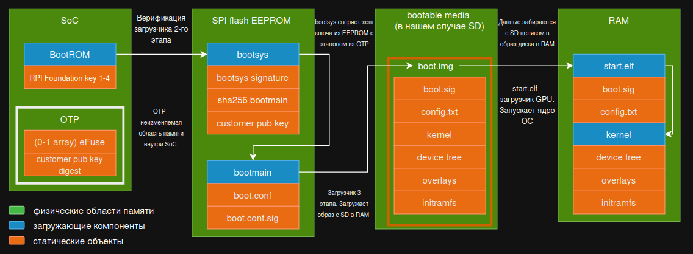

Под аббревиатурой RPI далее во всем документе подразумевается модель Raspberry Pi 4B, если не указано иного.

# <a name="_v8312jy0cpmq"></a>**Теория**
## <a name="_wa7x7p370tdk"></a><a name="_yh91b972ehwa"></a>**Определения**

<a name="_m9x0pec0n3xv"></a>GPIO - General Purpose Input Output - универсальные выводы на RPI (два ряда выводов по 20 штекеров), которые могут быть настроены на вход и на выход для подключения внешних устройств. Работают с логическими уровнями TTL (3,3V для RPI).

SoC - System on a Chip - Система на кристалле - основной функциональный узел RPI, который объединяет на одном кремниевом кристалле все необходимые для вычислений компоненты. В случае RPI 4 это CPU, GPU, контроллер RAM и периферийные контроллеры, такие как USB, Ethernet, GPIO. В классических ПК эти компоненты располагаются отдельно.

ROM - Read Only Memory - память только для чтения. Энергонезависимая память, данные в которой хранятся после выключения питания. Данные в ней обычно не меняются. Обладает относительно низкой скоростью чтения и записи. Применение в телефоне - хранение BIOS/UEFI, ОС,  фото/видео и приложений. Аналогичное название - ПЗУ - постоянное запоминающее устройство.

BootROM - загрузочая ROM - неизменяемая область постоянной памяти внутри кристалла SoC. Запись происходит при прошивании на заводе, ее нельзя  изменить или обновить. BootROM является корнем доверия всей системы. В ней хранятся начальные инструкции для процессора, алгоритм поиска загрузчика, публичные ключи для проверки цифровой подписи следующего этапа загрузки, минимальный код (драйверы) для работы с RAM и интерфейсами передачи данных. Аналогичные названия - загрузочное ПЗУ, первичный загрузчик. 

Secure-boot - Безопасная загрузка - механизм, который использует криптографическую подпись, чтобы убедиться, что ядро ОС и все необходимые загружаемые компоненты, загруженные в RAM, подписаны закрытым ключом разработчика. 

SPI - Serial Peripheral Interface - последовательный синхронный интерфейс передачи данных, используемый для высокоскоростной связи между контроллерами и периферийными устройствами на коротких расстояниях. Физически - это 4-х проводная (four-wire) шина, работающая в режиме полного дуплекса (одновременный обмен) по принципу ведущий/ведомый (Master & Slave). Используется для подключения контроллера к SD-картам, дисплеям, датчикам и модулям связи.

<details>
<summary>Тут про SPI flash, NOR и NAND память. Это можно не читать, для общего развития (как будто до этого было не оно)</summary>
<br>

SPI flash - энергонезависимая NOR flash память, использующая SPI для передачи данных. Используется для хранения BIOS/UEFI, данных и конфигураций. 

NOR flash память - flash память, оптимизированная для быстрого побайтового чтения информации. Имеет возможность выполнения кода непосредственно из микросхемы, т.е. без копирования в RAM. Используется для хранения BIOS и прошивок.

NAND flash память - flash память, предназначенная для больших объемов хранения пользовательской информации. На ее основе сделаны SSD-накопители и карты памяти. 

Развитие кончилось. Дальше база.
</details>

EEPROM - Electrically Erasable Programmable Read Only Memory - энергонезависимая память, позволяющая перезаписывать данные побайтно, в то время как flash память перезаписывает данные блоками (страницами).

> Для нас интересно то, что в RPI на ней хранится конфигурация загрузчика второго этапа и публичный ключ разработчика.

OTP - One Time Programmable memory - энергонезависимая однократно записываемая память внутри SoC. Изменения необратимы благодаря пережиганию перемычек (0 → 1). Используется для включения Secure Boot и хранения хеша публичного ключа разработчика

Еще немного про OTP и как он работает: 

Бит отзыва ключей. Если один из закрытых ключей RPI Foundation был скомпрометирован, то обновить BootROM невозможно. Вместо этого RPI Foundation выпускает обновление, которое дает команду сжечь определенную ячейку (eFuse). При следующей загрузке BootROM считывает этот бит отзыва из OTP. Если он равен 1, то BootROM понимает, что соответствующий ключ скомпрометирован, отбрасывает его и переходит к проверке подписи с использованием следующего резервного ключа.

SDRAM - Synchronous Dynamic Random Access Memory - синхронная динамическая память с произвольным доступом. Имеет высокую скорость передачи данных благодаря работе в такт с системной шиной. В данный момент (почти) является синонимом памяти DDR[1-5].

Автономный RAM диск - виртуальный диск, записанный в RAM, который функционирует независимо от основной файловой системы, чтобы избежать атаки между проверкой и загрузкой ядра ОС (TOCTOU).

Цифровая подпись RSA - Сигнатура RSA - криптографический механизм, позволяющий подтвердить, что загружаемый файл был подписан владельцем закрытого ключа и не подвергался модификации.


<details>
<summary><a name="_qwkuvsue465"></a>Алгоритм работы RSA</summary>

> Тут в очередной раз описывается алгоритм работы RSA. Кому-то скучно, а кому-то (и таких много) будет полезно.

1\. Возьмем простые числа p и q.<br>
2\. Найдем их произведение: n = p⋅ q.<br>
3\. Вычисляем функцию Эйлера: φ(n) = (p -1 ) ⋅ (q - 1) [Ф-я, значение которой равно количеству натуральных чисел, меньших или равных N и взаимно простых с ним]<br>
4\. Выбираем число e (обычно простое), которое меньше φ(n) и является взаимно простым с φ(n).<br>
5\. Ищем число d, обратное числу e по модулю φ(n).<br>

Т.е.  d ⋅ e = 1 mod (φ(n)). Найти его можно через расширенный алгоритм Евклида.

Тогда:
{e, n} - открытый ключ<br>
{d, n} - закрытый ключ<br>

Шифрование и расшифрование передачи сообщений:

Пусть есть два человека, которые общаются: Алиса и Боб. Договоримся, что Боб создал открытый и закрытый ключ. Свой открытый ключ Боб передал Алисе в открытом виде. Алиса хочет передать сообщение M Бобу.

|Шаг|Alice|Bob|
| :-: | :-: | :-: |
|1|M, {e, n}|{e, n}, {d, n}|
|2|C = M<sup>e</sup> mod (n)  –отправляет→||
|3||C, {d, n}|
|4||M = C<sup>d</sup> mod(n)|

Пусть есть два человека, которые общаются: Алиса и Боб. Договоримся, что Боб создал открытый и закрытый ключ. Свой открытый ключ Боб передал Алисе (и вообще всему миру) в открытом виде. Боб хочет отправить сообщение M, чтобы каждый его получатель убедился, что его написал именно Боб и сообщение дошло до адресата без изменений. Для этого была придумана цифровая подпись.

Алгоритм цифровой подписи RSA:

|Шаг|Alice|Bob|
| :-: | :-: | :-: |
|1|{e, n}|M, {e, n}, {d, n}|
|2|{e, n}|m = hash(M)|
|3|{e, n}|←отправляет– {S = m<sup>d</sup> mod(n), M}|
|4|m<sub>1</sub> = S<sup>e</sup> mod(n); m<sub>2</sub> = hash(M)||
|5|m<sub>1</sub> =?= m<sub>2</sub>||

Если S<sup>e</sup> mod(n) == hash(M), тогда сообщение признается сообщением Боба, иначе – нет. При этом, только обладатель секретного ключа d может сформировать цифровую подпись S по документу M, а найти d, зная e не легче, чем разложить модуль n на множители.

Кроме того, результат проверки будет положительным только тогда, когда при вычислении S был использован секретный ключ d, соответствующий ключу e.

В таком случае говорят, что документ M подписан цифровой подписью S.

> Фуф, осилили, давайте дальше.

</details>

Bootsys - загрузчик второго этапа, размещенный в EEPROM.

Bootmain - загрузчик третьего этапа, размещен в EEPROM, отвечает за инициализацию RAM.

## <a name="_p8fnhc4ffzl9"></a>**Создание подписи легитимного bootsys:**
1. Файл bootsys пропускают через алгоритм хеширования SHA-256. 
1. Этот хеш шифруется закрытым ключом. 

Полученный результат - цифровая подпись.

## <a name="_652vb7xwuz75"></a>**Проверка файла BootROM-ом:**
1. BootROM расшифровывает подпись с помощью встроенного публичного ключа и получает исходный хеш легитимного файла.
1. BootROM самостоятельно вычисляет хеш от bootsys, лежащего в EEPROM.
1. Хеши сравниваются.

<details> 
<summary>Зачем это нужно? А без RSA никак нельзя?</summary>

Если не использовать шифрование закрытым ключом, а просто сравнивать хеш от boot.img, записанный в файле на SD карте в файле hash.txt, тогда возможен такой алгоритм:

1\. Загрузчик считает хеш от boot.img<br>
2\. Сравнивает его с hash.txt.

Совпали - продолжаем загрузку.

Но тогда злоумышленник может перезаписать файл boot.img, пересчитать новый хеш и положить его в hash.txt. При проверке загрузчик увидит совпадение и загрузит нелегитимный файл.

Чтобы избежать этого, хеш шифруется закрытым ключом {d, n}. Результат этого шифрования находится в файле boot.sig (S). Именно boot.sig является цифровой подписью загружаемой программы boot.img (M). Загрузчик расшифровывает boot.sig открытым ключом, получает оригинальный хеш и сравнивает его с самостоятельно вычисленным хешем файла boot.img.

Злоумышленник может подменить boot.img, заменить подпись S на подпись S\_fake, но S<sup>e</sup>\_fake mod(n) != hash(boot.img), так что такую подмену сразу заметят.

Фуф! Давайте уже к загрузке. Подышать надо.
</details> 

## <a name="_xbqip6nqwjiu"></a>**Этапы безопасной загрузки**
<figure>
  <div align="center">
    
    <figcaption><br>Схема безопасной загрузки</figcaption>
  <div align="center">
</figure>

1. Проверка первичным загрузчиком (BootROM): BootROM считывает состояние OTP. Если безопасная загрузка активирована, BootROM проверяет цифровую подпись загрузчика второго этапа (bootsys), находящегося в SPI flash, сверяя ее с публичными ключами RPI Foundation, зашитыми в BootROM. При этом учитываются биты отзыва ключей из OTP-памяти. Если проверка пройдена, то управление передается bootsys.
1. Верификация ключа разработчика: bootsys извлекает из EEPROM ключ разработчика и вычисляет его SHA-256 хеш. Этот хеш сверяется с эталонным хешем, записанным в OTP.
1. Верификация файла конфигурации. bootsys проверяет подпись файла конфигурации boot.conf.sig с использованием публичного ключа разработчика. При успешной проверке bootsys загружает загрузчик третьего этапа (bootmain). 
1. Загрузка boot.img. Bootmain инициализирует SDRAM и загружает в RAM файл boot.img, который представляет собой FAT ramdisk. Bootmain проверяет подпись boot.img, используя файл boot.sig и публичный ключ разработчика.
1. Передача управления start.elf. Bootmain использует проверенный образ в оперативной памяти (RAM-диск), чтобы передать управление загрузчику GPU (start.elf), который извлекает ядро ОС и дерево устройств непосредственно с доверенного ramdisk-образа, находящегося в памяти.
1. Включение ОС. Ядро Linux начинает выполнение.
# <a name="_566w5htlf8ky"></a>**Выполнение лабораторной работы:**

## <a name="_i4z2ioednqg"></a><a name="_pmnyyjnxr6ib"></a>**Генерация ключей**

Хостовой машиной в приводимой работе является Ubuntu 24.04.4 LTS x86\_64. При использовании других дистрибутивов Linux наборы изначально установленных пакетов, необходимые для выполнения лабораторной работы, могут отличаться.

Создадим ключи в формате PEM в терминале хостовой машины (создаваемые файлы внутри себя используют длинные числа p и q, которые нужны для генерации ключей по алгоритму RSA, который описывался ранее. Таким образом, вместо работы с числами руками, мы делегируем ее утилите openssl):
```bash
# Генерация приватного ключа. Этот файл не должен попасть на устройство
openssl genrsa 2048 > private.pem<br><br>

# Извлечение публичного ключа. Этот ключ будет встроен в EEPROM
openssl rsa -in private.pem -out public.pem -pubout -outform PEM<br>
# Установка переменной окружения для скриптов, которые мы дальше будем использовать
export KEY\_FILE=$(pwd)/private.pem
```

Потеря файла private.pem после того, как хеш public.pem будет прожжен в OTP, означает невозможность обновления системы. 

**Серьезно. Прямо сейчас сделай бэкап.**

## <a name="_7r09f0tqnin5"></a>**Подготовка к записи EEPROM**
Перед тем как мы сможем прошить подписанный загрузчик, необходимо подготовить саму плату. У RPI 4B нет аппаратного переключателя для режима USB-загрузки.
### <a name="_co0eqx58j8kz"></a>**Конфигурация config.txt**
Нам нужно отредактировать файл config.txt на загрузочном разделе (/bootfs) обычной SD-карты с Raspberry Pi OS. Этот файл управляет поведением системы при включении. Вставьте SD в картридер в хостовое устройство и  отредактируйте файл /boot/config.txt.

```bash
# Включение UART для отладки
enable_uart=1
uart_2ndstage=1
# Работа в 64-битном режиме
arm_64bit=1
kernel=kernel8.img
# Параметры для перепрошивки EEPROM
# Полная очистка перед записью нового образа
erase_eeprom=1
# Назначение пина для входа в режим RPIBOOT
# При замыкании GPIO8 на землю при старте плата уйдет в режим прошивки по USB, игнорируя SD карту
program_rpiboot_gpio=8
# Временное разрешение записи
eeprom_write_protect=0
```

После сохранения файла на SD-карту, её нужно вставить в RPI, включить питание на несколько секунд для применения настроек (вы увидите активность светодиодов), а затем выключить. Теперь плата готова к прошивке через USB.
## <a name="_a73puobdj1i6"></a>**Клонирование и сборка инструментов usbboot**
Для взаимодействия с RPI в режиме прошивки нам понадобится утилита rpiboot.
### <a name="_jee4ry39jipd"></a>**Почему надо откатиться на коммит a4f46de?**
В репозитории raspberrypi/usbboot последние коммиты ориентированы на поддержку Raspberry Pi 5. Архитектура Pi 5 требует контр-подписи самого загрузчика bootcode.bin (второй стадии) ключом пользователя. Для академических целей на Pi 4B это избыточно усложняет процесс.  
### <a name="_aslozk6rr9b6"></a>**Сборка на хостовой машине**

```bash
# Клонирование с сабмодулями для tools/
git clone --recurse-submodules https://github.com/raspberrypi/usbboot secure-boot
cd secure-boot

# Откат до стабильной точки
git checkout a4f46de<br>git submodule update --init

# Компиляция утилиты
make
sudo make install

# Запускаем сервер
sudo rpiboot
```

После успешного выполнения в корне директории появится исполняемый файл ./rpiboot. Он будет работать как сервер, отдающий файлы прошивки по протоколу USB-OTG.

Так как ранее в файле /boot/config.txt для входа в режим RPIBOOT мы назначили именно GPIO 8, то теперь нам нужно замкнуть его на землю.  Для этого используется перемычка, соединяющая пин GPIO 8 и любой пин GND.

<figure>
  <div align="center">
    
    <figcaption><br>Распиновка GPIO RP</figcaption>
  </div>
</figure>

**ВАЖНО!** Сборку схемы проводить строго при отключенном питании. После установки перемычки позовите преподавателя. На данном этапе провод питания включать не требуется.

Подключите RPI в USB порт компьютера (провод: USB-A[хост] – USB type-c[RPI] ) и дождитесь процедуры прошивки EEPROM.

Вывод будет примерно такой:

```bash
RPIBOOT: build-date <date> pkg-version local a4f46dec
<...>
Second stage boot server
File read: mcb.bin
File read: memsys00.bin
<…> read: memsys08.bin
File read: bootmain
Cannot open file boot.sig
```


## <a name="_j3un9ngjj1cm"></a>**Настройка конфигурации EEPROM** 

### <a name="_ux7pgtsbthln"></a>**Файл boot.conf**
На хостовом устройстве в директории secure-boot-recovery находится файл boot.conf. Это текстовая конфигурация EEPROM. Мы должны отредактировать её следующим образом:
```bash
[all]
# Включение UART критично. Без него при ошибке подписи вы увидите просто черный экран без объяснения причин
BOOT_UART=1

# Порядок загрузки: сначала SD-карта (1), потом USB (4), потом повтор (f)
BOOT_ORDER=0xf41

# Включение проверки подписей образов. Инструктирует bootmain искать файл boot.sig и проверять его
SIGNED_BOOT=1

# Защита от отката: запрет обновления EEPROM через rpi-eeprom-update в ОС
ENABLE_SELF_UPDATE=0
FREEZE_VERSION=1
```

### <a name="_90pnr3pnadtm"></a>**Использование update-pieeprom.sh**
Скрипт update-pieeprom.sh из директории tools/ – это автоматизированный инструмент, который:

1. Вызывает rpi-eeprom-digest для создания RSA-подписи конфигурации boot.conf.sig
1. Встраивает public.pem в прошивку pieeprom.bin
1. Создает контрольную сумму pieeprom.sig
```bash
cd secure-boot-recovery<br>../tools/update-pieeprom.sh -k "${KEY\_FILE}"
```
Теперь внутри pieeprom.bin лежит ваш публичный ключ. Когда вы запустите прошивку, recovery.bin увидит этот ключ, посчитает его хеш и прожжет его в OTP. 

## <a name="_y7kkbqng1ypp"></a>**Прошивка EEPROM через USB (режим RPIBOOT)**
Наступает самый ответственный момент. Мы будем прошивать EEPROM и прожигать OTP.
### <a name="_7hlv8fmg2u9u"></a>**Запуск сервера прошивки**
На вашем хостовом устройстве запустите rpiboot из директории secure-boot-recovery. 
```bash
# Запуск сервера из директории secure-boot-recovery
sudo ../rpiboot -d .
```
### <a name="_a0jgx7oxtods"></a>**Процесс прошивки**
Убедитесь, что перемычка GPIO8 - GND установлена.

Подключите RPI в USB порт компьютера (провод USB-A[хост] – USB type-c[RPI] ) и дождитесь процедуры прошивки EEPROM. 

Как только плата получит питание, она перейдет в режим USB-устройства. Ноутбук обнаружит её, и rpiboot начнет передачу файлов.

В терминале вы увидите (minicom включать не надо, вы будете видеть работу rpiboot): 
```bash
<...>
Waiting for BCM2835/6/7/2711/2712...
Loading: ./bootcode4.bin
Second stage boot server
Loading: ./config.txt
<...>
Second stage boot server done
```

После прошивки снимите перемычку GPIO8 и извлеките SD-карту, которую мы использовали для подготовки. 
### <a name="_dv9u0tbg4p97"></a>**Анализ вывода при отсутствии образа**
Подайте питание на RPI. Выводе minicom  вы должны увидеть следующее:

```bash
<...>
2.32 secure-boot (загрузчик перешел в режим проверки подписей)
2.33 Loading boot.img ... 
2.39 [sdcard] boot.img not found (такой мы пока не загрузили)
2.39 Error 6 loading boot.img (ожидаемая ошибка)
```

## <a name="_vweql8fgt71k"></a>**Подготовка загрузочного образа boot.img**
Загрузка Linux на RPI уязвима для атак класса TOCTOU (Time-of-Check to Time-of-Use). Злоумышленник может подменить ядро сразу после того, как загрузчик его проверил, но до того, как оно было считано в память.

Для решения этой проблемы используется boot.img – это образ файловой системы FAT32, который целиком копируется в оперативную память (RAM). Загрузчик проверяет подпись всего этого образа единовременно.

Содержимое типичного boot.img:

- config.txt (параметры ядра и overlay)
- kernel8.img (само ядро Linux)
- bcm2711-rpi-4-b.dtb (описание железа)
- start4.elf и fixup4.dat (прошивка GPU)
- initramfs8 (временная ФС с драйверами для монтирования зашифрованного корня)

Вы можете использовать готовый boot.img из директории secure-boot-example репозитория для тестов или собрать свой с помощью утилиты make-boot-image (это займет довольно ощутимое время).
### <a name="_urwh23sqyojt"></a>**Подпись образа скриптом sign.sh**
Теперь нам нужно заверить наш boot.img созданным ранее закрытым ключом. Для этого в папке secure-boot-example есть скрипт sign.sh.

Скрипт является оберткой над rpi-eeprom-digest. Его логика:

1. Вычисляется SHA-256 от всего файла boot.img.
1. Добавляется текущее время, чтобы старую, возможно уязвимую версию прошивки, нельзя было подложить загрузчику.
1. Полученный блок данных шифруется вашим приватным ключом.

```bash
# Подпись образа
./sign.sh ${KEY\_FILE}
```

Результатом работы является файл boot.sig. Если открыть его текстовым редактором, вы увидите хеш, временную метку и огромную строку в шестнадцатеричном формате – это и есть ваша цифровая подпись.
## <a name="_bt0w3f1lozxj"></a>**Загрузка и демонстрация защиты**
### <a name="_1epplzb3ffgz"></a>**Успешный проход цепочки доверия**
Скопируйте boot.img и boot.sig в загрузочный раздел (/bootfs) SD-карты. Вставьте карту в RPI и включите питание.

В выводе в терминале (с использованием утилиты minicom или screen) вы должны увидеть строки: 

```bash
2.50 hash: <hash>
2.55 ts: 1777923201
2.58 rsa2048: <long number>
6.85 Verifying
13.62 RSA verify
13.75 rsa-verify pass (0x0)
```

Это означает, что bootmain успешно расшифровал boot.sig вашим публичным ключом, встроенным в EEPROM, сравнил результат с хешем boot.img и они совпали.
### <a name="_sjygzbr1fdku"></a>**Негативный тест**
Сымитируем атаку: злоумышленник перехватил вашу SD карту и внес изменения в ваш файл: 
```bash
echo "hacked" | tee -a /media/[path]/bootfs/boot.img > /dev/null
```

Попробуйте загрузиться аналогично пункту успешной загрузки.

Ожидаемый результат: 
```bash
2.51 secure-boot
2.53 Loading boot.img ...
2.61 boot.sig
2.61 hash: <hash>
2.69 rsa2048: <long number>
6.94 Verifying
13.97 Bad signature boot.img
13.26 Error 12 loading boot.img
```

#### <a name="_w5q0xfvyr0u8"></a>**Почему не получилось**
При выполнении команды мы модифицируем содержимое файла boot.img. 

Когда bootmain попытался загрузить систему, произошли данные события:

1. bootmain вычисляет хеш SHA-256 от измененного boot.img
1. bootmain расшифровывает файл подписи boot.sig с помощью публичного ключа разработчика, который мы записали в EEPROM
1. В результате bootmain получает эталонный хеш немодифицированного boot.img
1. Два хеша сравниваются и не совпадают, так как даже незначительное изменение входных данных хеш-функции значительно меняет ее результат

bootmain зафиксировал нарушение целостности и в штатном редиме прервал загрузку, защитив устройство от несанкционированного доступа. Цепочка доверия отработала корректно.
## <a name="_fx0c5uhp1yfc"></a>**Возврат системы в исходное состояние**
После лабораторной работы  нужно вернуть платы в «заводское» состояние, насколько это возможно.

Помните: OTP прожжен навсегда. Вы не можете стереть хеш своего ключа. Но вы можете вернуть плату в режим загрузки обычных (неподписанных) образов.
### <a name="_rxmsho7iv9x"></a>**Инструкция по восстановлению**
Хост-система: Установите Raspberry Pi Imager.
```bash
sudo apt install rpi-imager
```

Подготовка карты:

1. Вставьте SD-карту в ноутбук.
1. В Imager: Choose OS → Misc utility images → Bootloader → SD Card Boot.

Это создаст карту с прошивкой, которая сбрасывает настройки EEPROM в Default.

Прошивка:

1. Вставьте карту в RPI, включите питание.
1. Зеленый светодиод будет быстро мигать. Когда он начнет мигать равномерно и медленно – прошивка завершена.

Важное дополнение для прожженных плат:

В стоковом конфиге 
```bash
SIGNED_BOOT=0
```
Ваша плата будет грузить обычные ОС. Но если кто-то в будущем снова поставит SIGNED_BOOT=1, плата будет требовать ваш ключ.

